# Moe Project

## Overview

This project consists of two main parts: the backend (BE) and the frontend (FE). The backend is developed using Java and Spring Boot, while the frontend is built with React and TypeScript. Below is a detailed description of the technologies used, key backend features, deployment details, and placeholders for screenshots.

---

## Technologies Used

### Backend (Moe/)
- Java 17
- Spring Boot 3.3.4 (Web, Security, Data JPA, Mail, DevTools)
- MySQL as the primary database
- JWT (JSON Web Token) for authentication and authorization (using io.jsonwebtoken libraries)
- Lombok for boilerplate code reduction
- Hibernate Validator for input validation
- Apache POI for Excel file handling
- ModelMapper for object mapping
- Apache Commons Lang3 and Codec utilities
- Google API Client libraries for external API integrations
- Cloudinary SDK for media management
- FFmpeg wrapper for media processing
- dotenv-java for environment variable management
- Docker support (Dockerfile present)

### Frontend (Moe_fe/)
- React 18.3.1 with TypeScript
- Vite as the build tool
- Tailwind CSS with animation support
- Redux Toolkit and React Redux for state management
- React Router DOM for routing
- React Hook Form for form handling
- Axios for HTTP requests
- Radix UI component library (avatar, dialog, dropdown, tooltip, etc.)
- Framer Motion for animations
- Various utility libraries: lodash, js-cookie, qs, zod, clsx, lucide-react, next-themes, react-activation, react-intersection-observer, react-dropzone
- ESLint for code quality and linting
- Docker support (Dockerfile present)

---

## Backend Hidden Features

- **JWT Handling:** Secure authentication and authorization using JWT tokens validated on each request.
- **Exception Handling:** Centralized global exception handling to provide consistent error responses.
- **Logging System:** Comprehensive logging of all incoming requests and errors for monitoring and troubleshooting.
- **Authorization System:** Role-based access control (RBAC) to restrict resource access based on user roles.
- **User Activity Monitoring:** Tracks user activity status to determine if a user is currently active.

---

## Deployment

- **Frontend:** Deployed on Vercel  
  [https://moechan.vercel.app/client/home](https://moechan.vercel.app/client/home)

- **Backend:** Deployed on Render  
  Note: The backend service may take approximately 1 minute to start up after deployment.

- **Database:** MySQL hosted on Railway

- **Images and Media:** Hosted on Cloudinary

---

## Services Summary

| Service     | Provider  | Notes                          |
|-------------|-----------|--------------------------------|
| Frontend    | Vercel    | Fast global CDN, automatic deployments |
| Backend     | Render    | Auto-scaling, ~1 min startup time |
| Database    | Railway   | Managed MySQL database          |
| Media Store | Cloudinary| Cloud-based image and video hosting |

---

## Screenshots

Below are placeholder sections for screenshots. You can add images here later to showcase the application UI and features.

### Frontend Screenshots

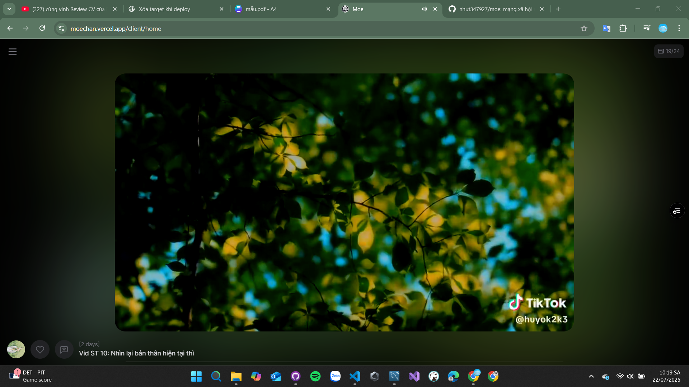

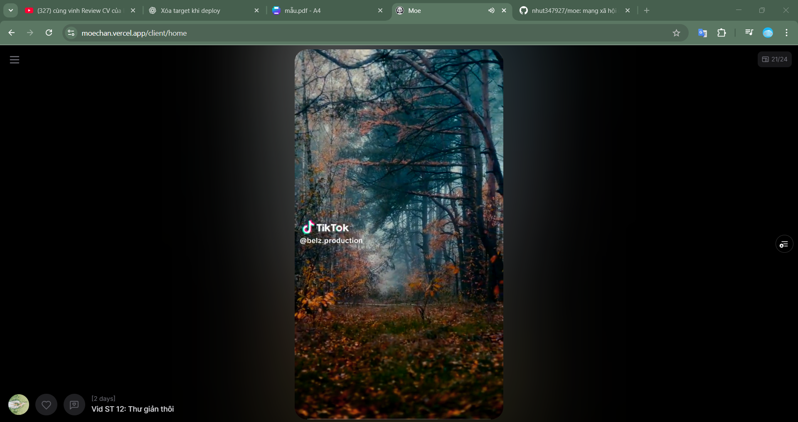

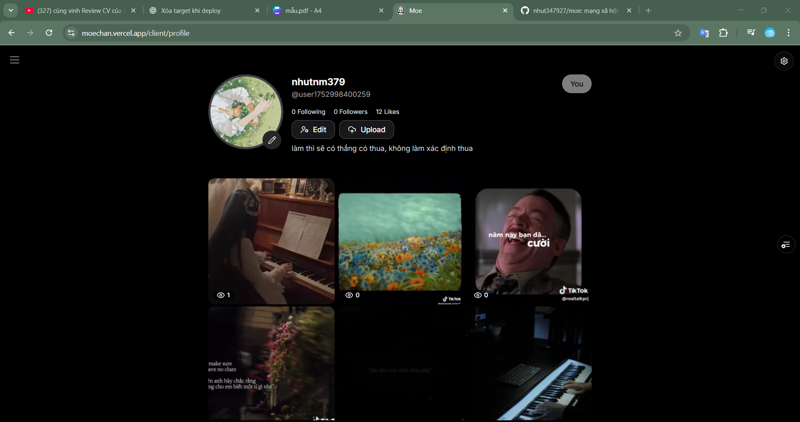

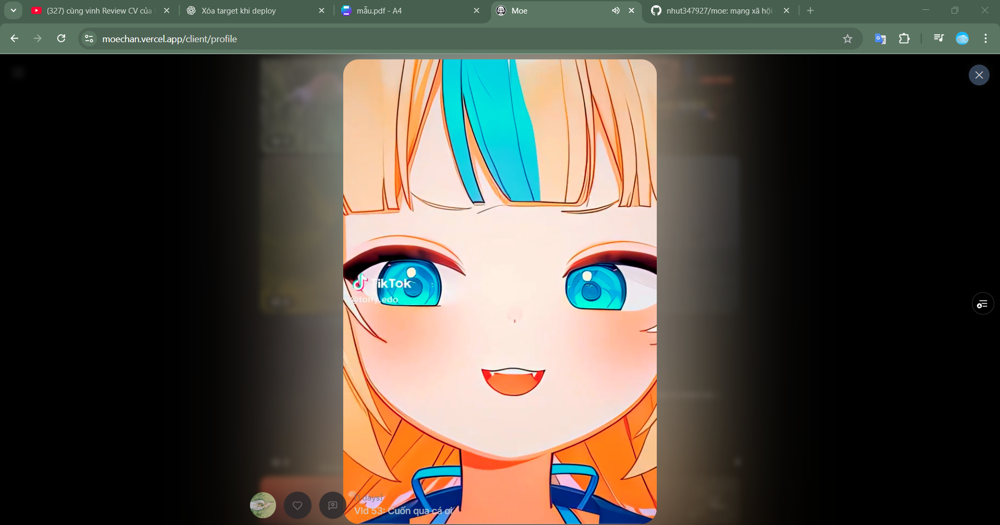

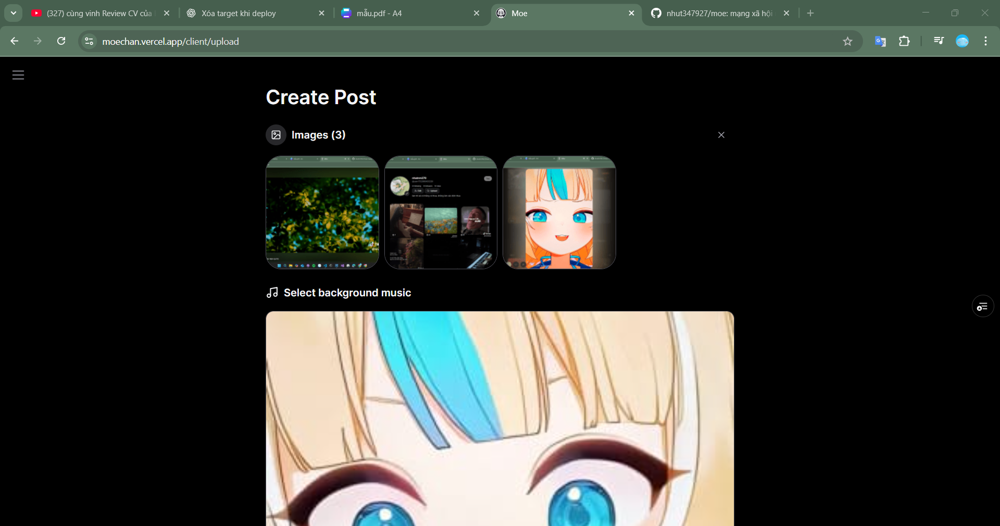

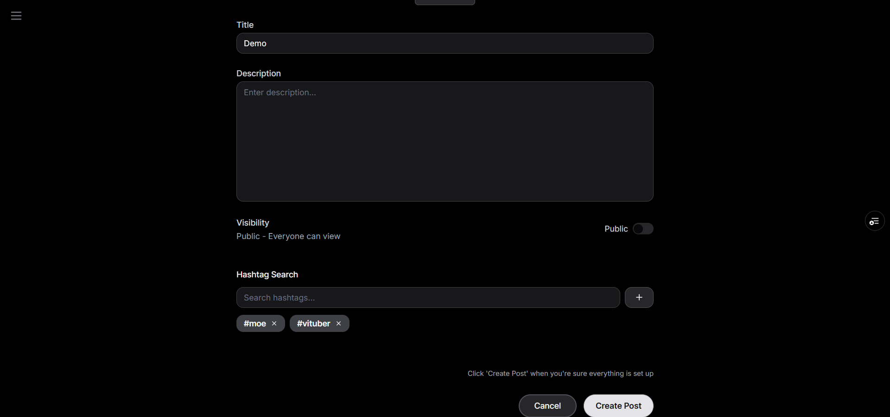

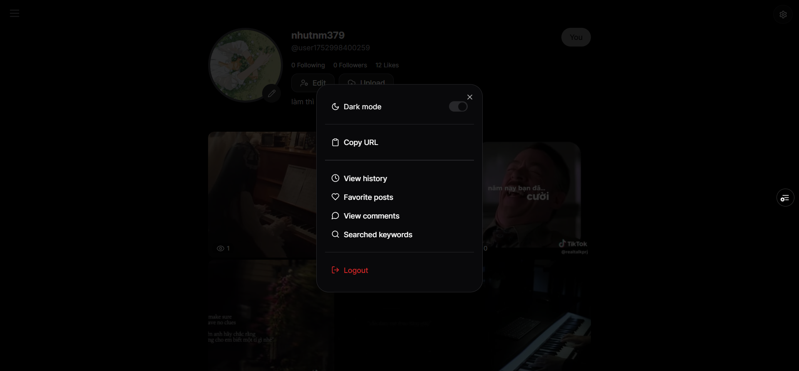

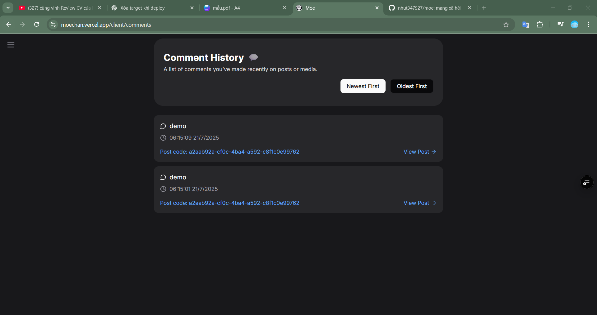

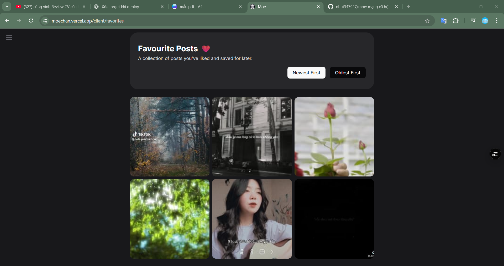

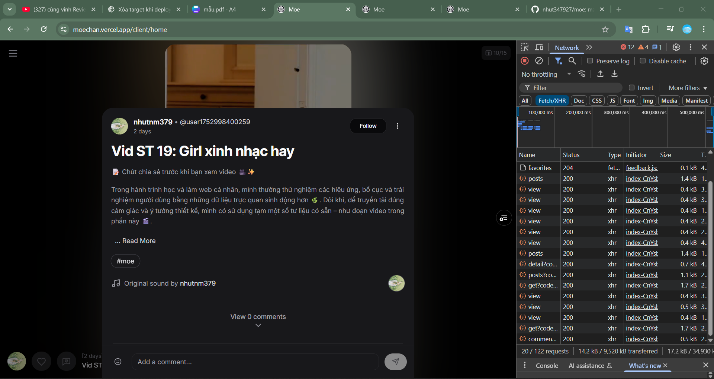

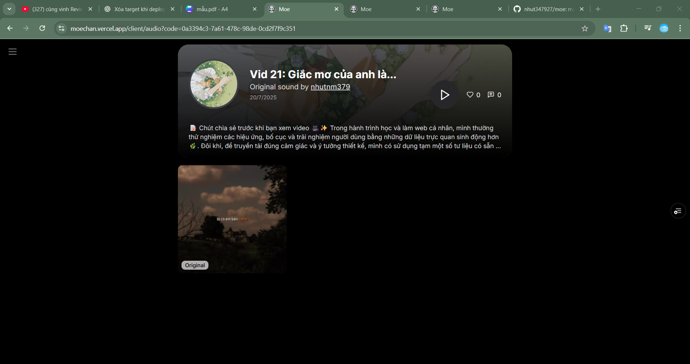

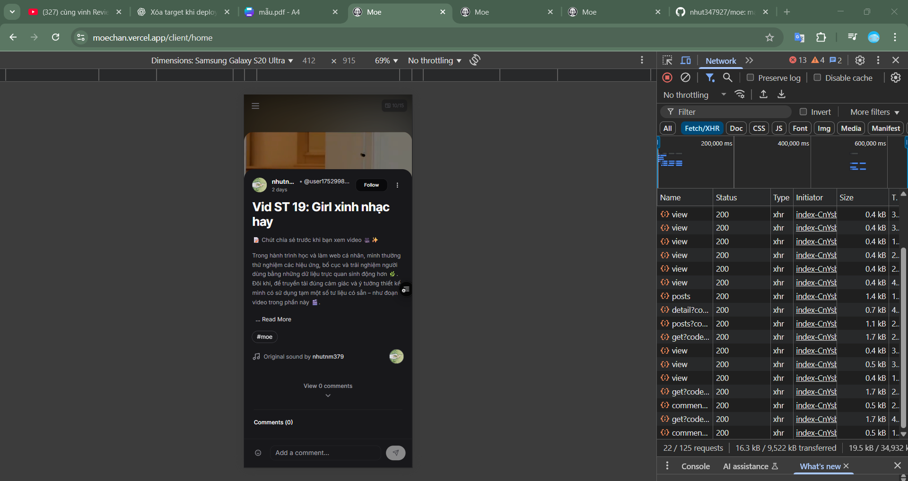

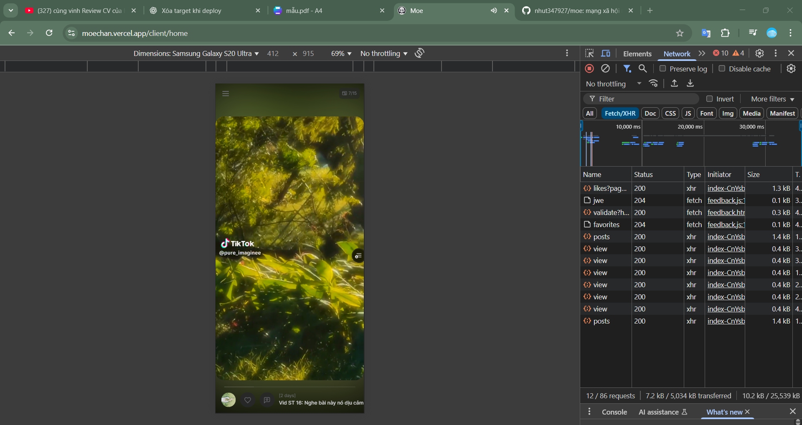

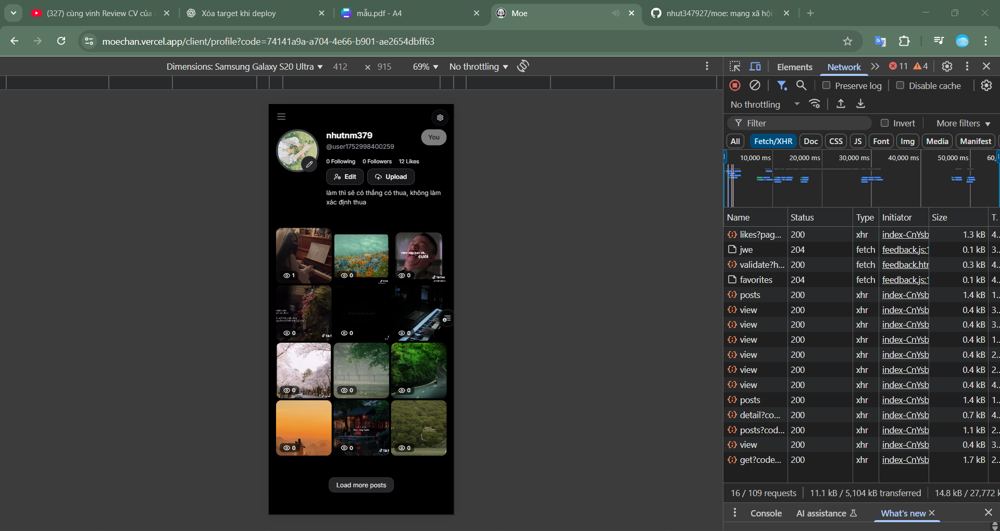

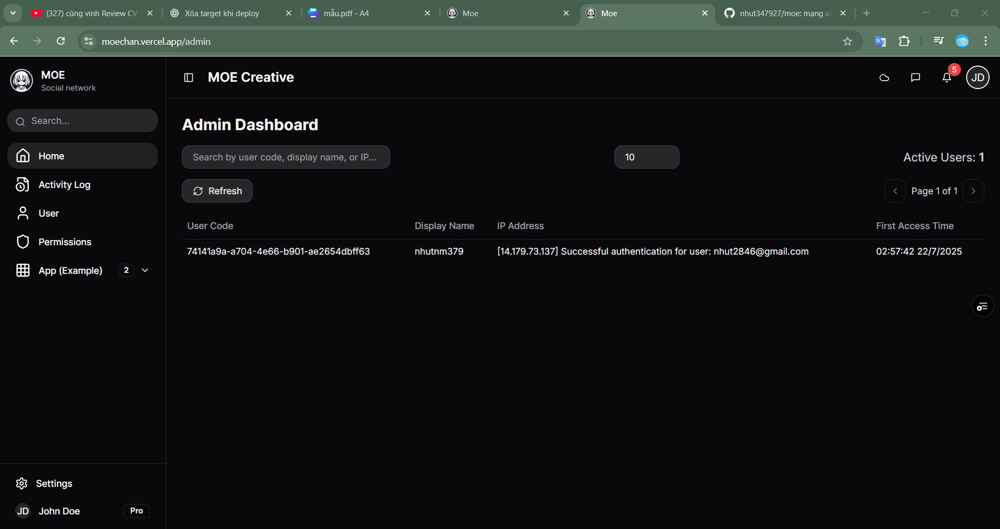

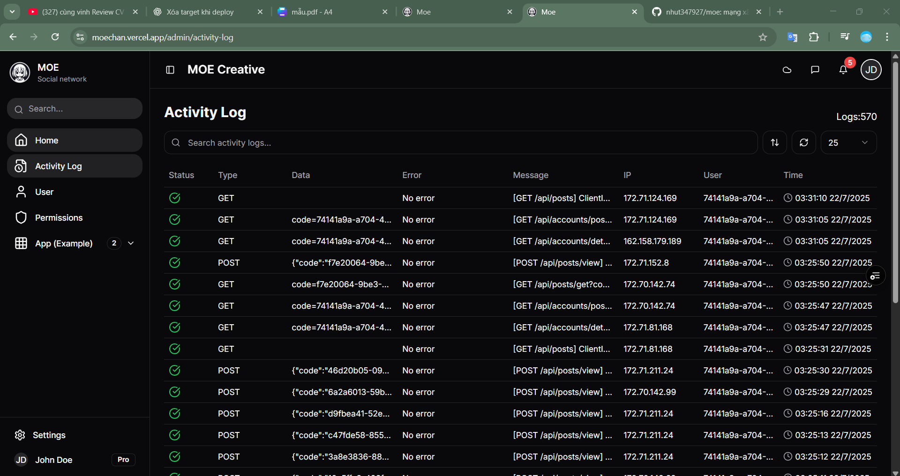

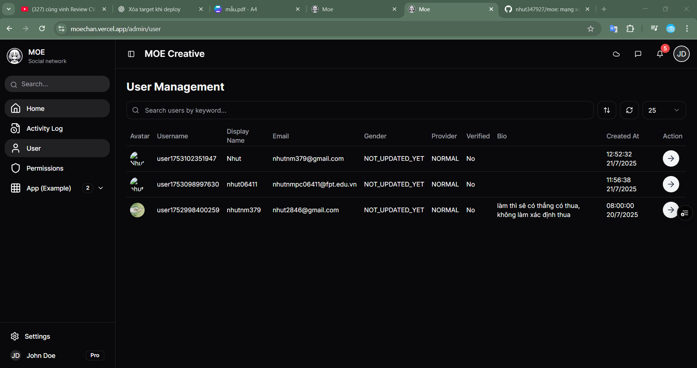

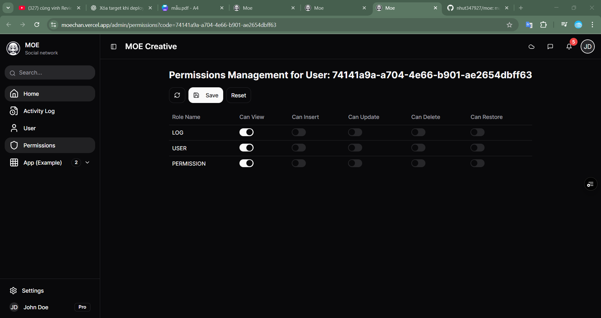

### Backend Screenshots

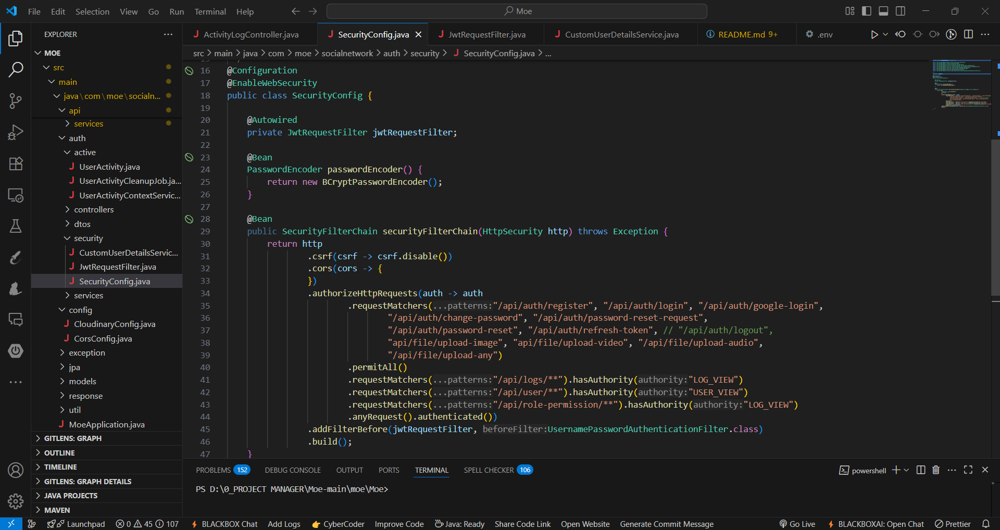
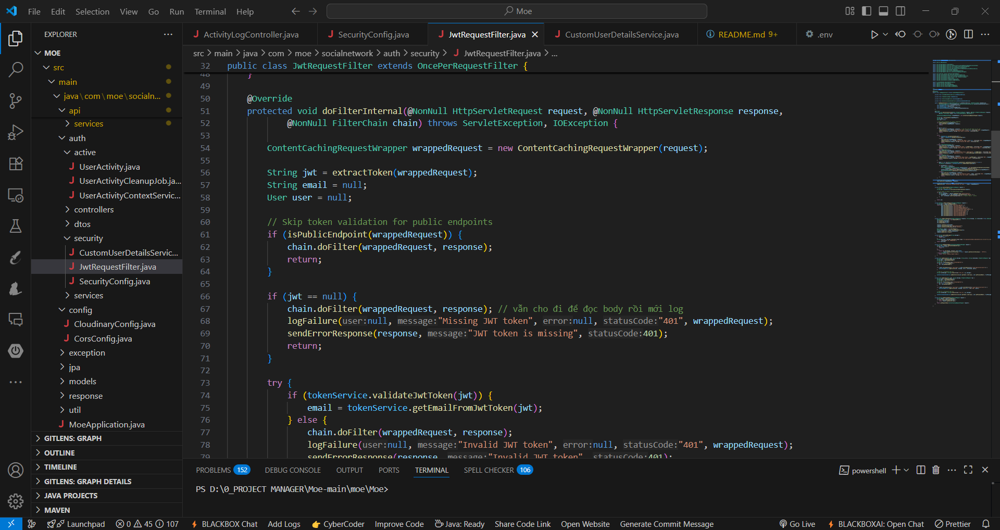
---

Thank you for using the Moe project! For any questions or contributions, please refer to the respective folders for backend and frontend source code.
